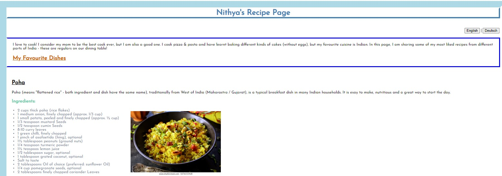

## Project: _Simple Recipe Page (in both English & Deutsch)_ ##
   This is a simple recipe page created using html and css. There are two html pages - one for English and one for German (Deutsch) - and both use same CSS sheet for styling.
   
#### Explanation ####
   "index_english.html" is html code file for English version of the page. Near to the right, there are two buttons to toggle between English and Deutsch. "English" invokes "index_english.html" and "Deutsch" invokes "index_html".
    "styles.css" is the styling sheet for both html pages.
   
###### Page Funtionalities: ###### 
   * Have made list of recipes under "My Favourite Recipes" (English) / "Meine Lieblingsgerichte" (Deutsch)" hover
   * Clicking on recipe in list points to the recipe on the page
   * Have added "Back to Top" at end of each recipe to reach the top of the page

##### Screenshot of index_english.html: #####

